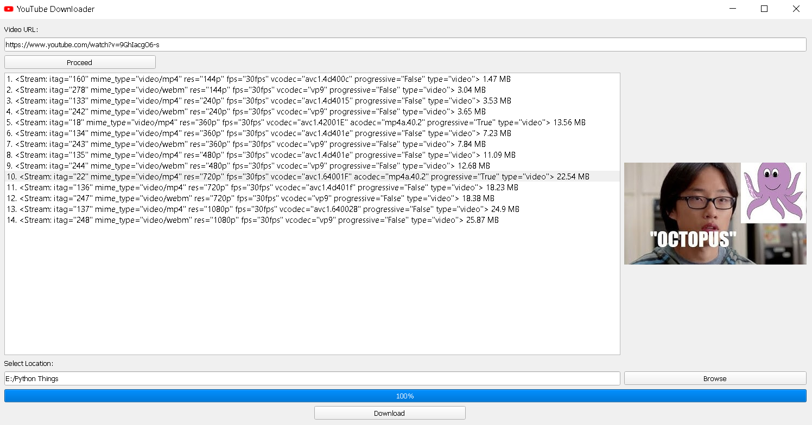

# A Python YouTube Downloader

I always wanted to build a Python GUI app, having a nice User Interface and then I found out about `tkinter`, `PyQt5` and `pytube`.
- `tkinter` is a python library used to bulid simple GUI apps with python
- `PyQt5` is the best library (I feel so) for building GUI apps for desktops, it really gives much more customization options than `tkinter` and with qt designer, it becomes a lot more easy and handy to build a desktop app with nice looking GUI
- `pytube` is a python library for getting all kind of info and stuff for any YouTube video(most importantly it downloads YouTube videos).

So I built a python GUI app to download YouTube videos on my local computer, which is basically a **YouTube Downloader**.
Firstly, I built YTD with `tkinter`, then I learned `PyQt5` & qt designer and built another YTD having a nice looking GUI, and which finally concluded my project and learnings.

## Working & Functionalities:
### `PyQt5` YTD
- Type/Paste in the URL of YouTube video
- Click on Proceed and it will show all resolutions options of the video as list with their sizes in MBs, it also shows the thumbnail of the YouTube video on the right space by fetching from YouTube.
- Choose the video you want to download and location at which it is to be saved.
- Click on the Download button and you'll see the downloaded percent on the progress bar.
- Technologies used: ***PyQt5, pytube, urllib***

### `tkinter` YTD
- Give the URL of YouTube video, and it will fetch all available resolutions of that video with their sizes in MBs, and lists out the options to download on the Command Prompt.
- It also keeps track of the progress of download by showing percentage downloaded on the cmd window.
- Technologies used: ***tkinter, pytube***

Through this project I learnt basics of `tkinter` & got to learn more than basics of `PyQt5`, also learnt to use **qt designer** which is used to build desktop apps without writing code, and `pytube` to interact with YouTube videos and fetch all kinds of info by python.
